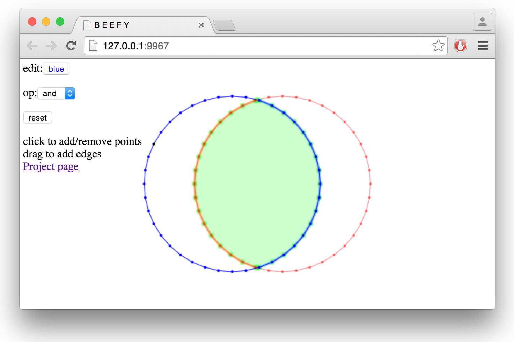
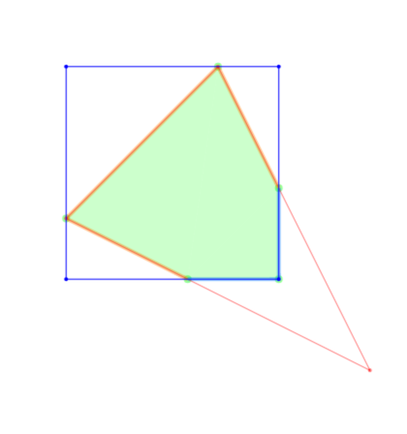

overlay-pslg
============
Compute a [regularized Boolean operation](rset) between the interiors of two [planar straight line graphs](pslg).

# [Demo](https://mikolalysenko.github.io/overlay-pslg)

[](https://mikolalysenko.github.io/overlay-pslg)

* Click to add points
* Drag to create edges
* Toggle red/blue points by clicking upper left button
* Select different Boolean operations

# Example

Here is a simple example showing how to use this module to compute the intersection of two PSLGs:

```javascript
//Load the module
var overlay = require('overlay-pslg')

//Red PSLG - Define a triangle
var redPoints = [
  [0.5, 0.25],
  [0.25, 0.5],
  [0.75, 0.75]
]
var redEdges = [ [0,1], [1,2], [2,0] ]

//Blue PSLG - Define a square
var bluePoints = [
  [0.25, 0.25],
  [0.25,  0.6],
  [0.6, 0.6],
  [0.6, 0.25]
]
var blueEdges = [ [0,1], [1,2], [2,3], [3,0] ]

//Construct intersection
console.log(overlay(redPoints, redEdges, bluePoints, blueEdges, 'and'))
```

#### Output

The result of this module is the following JSON:

```javascript
{ points:
   [ [ 0.6, 0.6 ],
     [ 0.44999999999999996, 0.6 ],
     [ 0.25, 0.5 ],
     [ 0.5, 0.25 ],
     [ 0.6, 0.44999999999999996 ] ],
  red: [ [ 1, 2 ], [ 2, 3 ], [ 3, 4 ] ],
  blue: [ [ 0, 1 ], [ 0, 4 ] ] }
```

We can visualize this result as follows:



# Install

To install this module, you can use [npm](http://docs.npmjs.com).  The command is as follows:

```
npm i overlay-pslg
```

It works in any reasonable CommonJS environment like [node.js](http://nodejs.org). If you want to use it in a browser, you should use [browserify](http://browserify.org).

# API

#### `require('overlay-pslg')(redPoints, redEdges, bluePoints, blueEdges[, op])`
Computes a Boolean operation between two planar straight line graphs.

* `redPoints, redEdges` are the points and edges of the first complex
* `bluePoints, blueEdges` are the points and edges of the second complex
* `op` the boolean operator to compute (Default `"xor"`).  Possible values include:
    + `"xor"` - computes the symmetric difference of `red` and `blue`
    + `"and"` - computes the intersection of `red` and `blue`
    + `"or"` - computes the union of `red` and `blue`
    + `"sub"` - comutes the set difference, `blue-red`
    + `"rsub"` - comutes the set difference, `red-blue`

**Returns** An object encoding a planar straight line graph with the edges partitioned into two sets:

* `points` are the points of the combined cell complex
* `red` are the edges in the resulting pslg coming from the red graph
* `blue` are the edges in the resulting pslg coming from the blue graph

**Note** The interiors of red and blue are computed using the same algorithm as `cdt2d`, which is it counts the parity of the path with the fewest number of boundary crossings for each point.  Even parity points are in the exterior, odd parity in the interior.

# License
(c) 2015 Mikola Lysenko. MIT License
